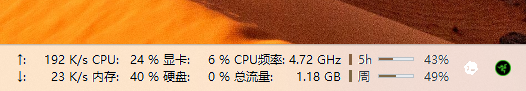
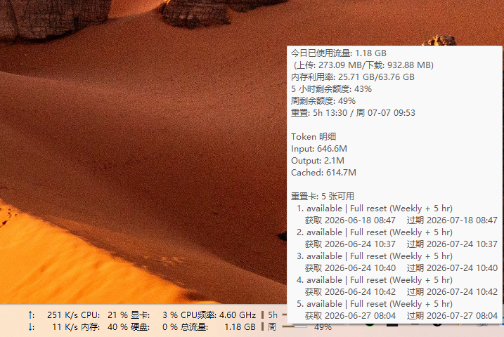
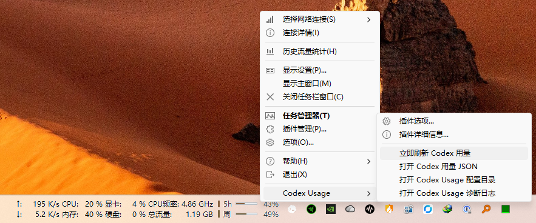

# TrafficMonitor Codex Usage Plugin

[中文](#中文) | [English](#english)

把 Codex 的 5 小时额度、周额度、重置时间和今日 Token 用量放进
[TrafficMonitor](https://github.com/zhongyang219/TrafficMonitor)。适合长期把
TrafficMonitor 常驻在任务栏或桌面的 Codex 用户。

## 截图 / Screenshots

**任务栏紧凑显示 / Taskbar view**

<p align="center">
  
</p>

**鼠标悬停详情 / Hover tooltip**

<p align="center">
  
</p>

**右键插件菜单 / Plugin context menu**

<p align="center">
  
</p>

## 中文

### 功能亮点

- 在 TrafficMonitor 显示两个项目：`Codex 5 小时额度` 和 `Codex 周额度`。
- 任务栏显示剩余额度百分比，并用小型进度条表现余量高低。
- 鼠标悬停提示框显示 5 小时/周剩余额度、重置时间、今日 `Input` / `Output` / `Cached` Token 明细。
- 双击任一显示项，或从插件命令选择“立即刷新 Codex 用量”，可立刻触发后台采集。
- 插件命令可打开状态 JSON、配置目录和诊断日志。
- “插件选项”可查看/复制状态文件、日志文件、采集脚本路径，并设置刷新时间间隔。
- “插件选项”可设置语言：`自动`、`中文` 或 `English`；自动模式会跟随 TrafficMonitor 当前语言。
- 可显示 Codex 额度重置卡数量和过期时间；敏感 token、cookie、完整唯一 ID 不会写入状态文件。

### 运行要求

- Windows + TrafficMonitor。
- Python 3，采集脚本会优先使用 `python`，其次使用 `py -3`。
- 本机存在 Codex 数据目录，默认是 `%USERPROFILE%\.codex`。
- 从源码构建时需要 Visual Studio C++ Build Tools 或 Visual Studio 的 C++ 工具链。

### 快速安装

1. 从 [Releases](https://github.com/Uddoo/TrafficMonitor-Codex-Plugin/releases) 下载
   `CodexUsage-TrafficMonitor-x64.zip`。
2. 将压缩包内容解压到 TrafficMonitor 的 `plugins` 目录，保持下面的相对结构：

   ```text
   plugins\
     CodexUsage.dll
     scripts\
       update_codex_usage.ps1
       collect_codex_usage.py
   ```

3. 重启 TrafficMonitor。
4. 在 TrafficMonitor 的显示项目设置中启用：
   - `Codex 5 小时额度`
   - `Codex 周额度`

### 从源码构建

推荐使用仓库自带脚本：

```powershell
.\tools\build.ps1 -Platform x64 -Configuration Release
```

输出文件位于：

```text
build\x64\Release\CodexUsage.dll
build\x64\Release\scripts\
```

如果当前 TrafficMonitor 环境不要求 DLL 签名，可跳过签名：

```powershell
.\tools\build.ps1 -Platform x64 -Configuration Release -SkipSign
```

也可以显式指定证书：

```powershell
$env:CODEX_TRAFFICMONITOR_SIGN_THUMBPRINT = '<code-signing-cert-thumbprint>'
.\tools\build.ps1 -Platform x64 -Configuration Release
```

或直接使用 CMake：

```powershell
cmake -S . -B build\cmake-x64 -A x64
cmake --build build\cmake-x64 --config Release
```

### 手动采集

可以先手动生成一次状态 JSON，确认采集链路正常：

```powershell
.\scripts\update_codex_usage.ps1
```

默认输出到：

```text
%USERPROFILE%\.codex\trafficmonitor\codex_usage_status.json
```

插件运行时默认使用 TrafficMonitor 传入的插件配置目录：

```text
<TrafficMonitor 配置目录>\plugins\CodexUsage\codex_usage_status.json
<TrafficMonitor 配置目录>\plugins\CodexUsage\codex_usage_plugin.log
<TrafficMonitor 配置目录>\plugins\CodexUsage\codex_usage_plugin.ini
```

常用环境变量：

- `CODEX_TRAFFICMONITOR_USAGE_JSON`：指定 DLL 读取和脚本写入的状态 JSON 路径。
- `CODEX_TRAFFICMONITOR_PYTHON`：指定 `python.exe` 路径。
- `CODEX_HOME`：指定 Codex 数据目录，默认 `%USERPROFILE%\.codex`。

插件配置文件 `codex_usage_plugin.ini` 会保存：

- `refresh_interval_seconds`：自动刷新间隔。
- `language`：`auto`、`zh-CN` 或 `en-US`。

### 数据来源与隐私

采集脚本只读取本机 Codex 数据：

```text
%USERPROFILE%\.codex\sessions\**\*.jsonl
%USERPROFILE%\.codex\logs_2.sqlite
%USERPROFILE%\.codex\sqlite\logs_2.sqlite
%USERPROFILE%\.codex\state_5.sqlite
%USERPROFILE%\.codex\sqlite\state_5.sqlite
```

额度优先来自 session JSONL 中 `event_msg` / `token_count` 携带的
`rate_limits`；如果新格式不可用，再回退到日志中的 `codex.rate_limits`
websocket 事件。`primary.window_minutes=300` 作为 5 小时额度，
`secondary.window_minutes=10080` 作为周额度。

今日 Token 明细优先读取 rollout JSONL 里的
`token_count.info.total_token_usage`，按本机当天增量统计 `Input`、`Output`
和 `Cached`。完整 JSON 字段说明见 [docs/data-format.md](docs/data-format.md)。

为了显示 Codex 额度重置卡，采集脚本会读取
`%USERPROFILE%\.codex\auth.json` 中的 `tokens.access_token`，并请求 ChatGPT 的
reset-credit 接口。状态 JSON 和 tooltip 只保留可用数量、状态、标题、获取时间和过期时间；
不会写出 access token、refresh token、cookie 或完整唯一 ID。若 auth 缺失、401
或请求失败，则不显示重置卡区域。

### 常见问题

**插件没有加载**

确认 `CodexUsage.dll` 与 `scripts\` 位于 TrafficMonitor `plugins` 目录下，并且
TrafficMonitor 与 DLL 架构一致。某些 Windows Code Integrity 策略会拦截未签名 DLL；
这种情况下请用本机代码签名证书重新构建。

**显示 `旧` 或重置时间过期**

Codex 没有稳定公开的本地额度 API。最新额度事件超过 6 小时没有刷新时，插件会显示
`旧`，表示百分比和重置时间可能已经过期。打开 Codex 产生新的用量事件，或在插件菜单中
执行“立即刷新 Codex 用量”后再观察。

**Token 明细为空**

确认 `CODEX_HOME` 指向正确的 Codex 数据目录，并检查诊断日志是否能找到 Python。
如果 rollout 统计不可用，状态 JSON 会保留旧日志/线程汇总字段作为兼容数据。

### 开发与发布

运行测试：

```powershell
python -m unittest discover -s tests -v
```

推送 `v*` tag 会触发 GitHub Actions：

- 运行 Python 单元测试。
- 构建 x64 Release DLL。
- 打包 `CodexUsage.dll` 和 `scripts/`。
- 将 `CodexUsage-TrafficMonitor-x64.zip` 上传到 GitHub Release。

发布包默认未签名；如果你的 TrafficMonitor 环境要求代码签名，请用本机证书重新构建并签名。

### 许可证

MIT License。详见 [LICENSE](LICENSE)。

---

## English

TrafficMonitor Codex Usage Plugin shows Codex usage limits inside
[TrafficMonitor](https://github.com/zhongyang219/TrafficMonitor): the 5-hour quota,
weekly quota, reset time, today's token breakdown, and optional reset-credit cards.

### Features

- Adds two TrafficMonitor items: `Codex 5-hour quota` (`5h`) and `Codex weekly quota` (`wk`).
- Renders remaining quota as compact percentage text plus a small bar.
- Shows reset times and today's `Input` / `Output` / `Cached` tokens in the tooltip.
- Refreshes on item double-click or through the plugin command menu.
- Opens the status JSON, config directory, and diagnostic log from plugin commands.
- Provides an options dialog for refresh interval, language, and file-path inspection/copying.
- Keeps reset-credit output sanitized; access tokens, refresh tokens, cookies, and full IDs are not written to the status JSON.

### Requirements

- Windows + TrafficMonitor.
- Python 3 available as `python` or `py -3`.
- A local Codex data directory, usually `%USERPROFILE%\.codex`.
- Visual Studio C++ Build Tools only if you build from source.

### Install

1. Download `CodexUsage-TrafficMonitor-x64.zip` from
   [Releases](https://github.com/Uddoo/TrafficMonitor-Codex-Plugin/releases).
2. Extract the zip contents into TrafficMonitor's `plugins` directory:

   ```text
   plugins\
     CodexUsage.dll
     scripts\
       update_codex_usage.ps1
       collect_codex_usage.py
   ```

3. Restart TrafficMonitor.
4. Enable `Codex 5-hour quota` and `Codex weekly quota` in TrafficMonitor's display-item settings.

### Language

The options dialog supports `Auto`, `Chinese`, and `English`. Auto follows the
current TrafficMonitor language, and other non-Chinese host languages fall back to English.
The setting is saved in `codex_usage_plugin.ini` as `language=auto`, `zh-CN`, or `en-US`.

### Build

```powershell
.\tools\build.ps1 -Platform x64 -Configuration Release
```

To skip code signing:

```powershell
.\tools\build.ps1 -Platform x64 -Configuration Release -SkipSign
```

The build output is:

```text
build\x64\Release\CodexUsage.dll
build\x64\Release\scripts\
```

### Data And Privacy

The collector reads local Codex session/log/state files under `%USERPROFILE%\.codex`.
Rate limits are parsed from session JSONL `rate_limits` first, then from legacy
`codex.rate_limits` log events. The 300-minute primary window is treated as the
5-hour quota; the 10080-minute secondary window is treated as the weekly quota.

Today's token breakdown is derived from rollout JSONL `token_count.info.total_token_usage`
when available. See [docs/data-format.md](docs/data-format.md) for the status JSON schema.

For reset-credit display, the collector may use the local Codex `auth.json` access token
to call the ChatGPT reset-credit endpoint. The output is sanitized and omits credentials
and full unique IDs. If auth is missing or the request fails, the reset-credit section is hidden.

### Development

```powershell
python -m unittest discover -s tests -v
```

Pushing a `v*` tag runs GitHub Actions tests, builds the x64 Release DLL, packages the
DLL plus scripts, and uploads `CodexUsage-TrafficMonitor-x64.zip` to the GitHub Release.

### License

MIT License. See [LICENSE](LICENSE).
